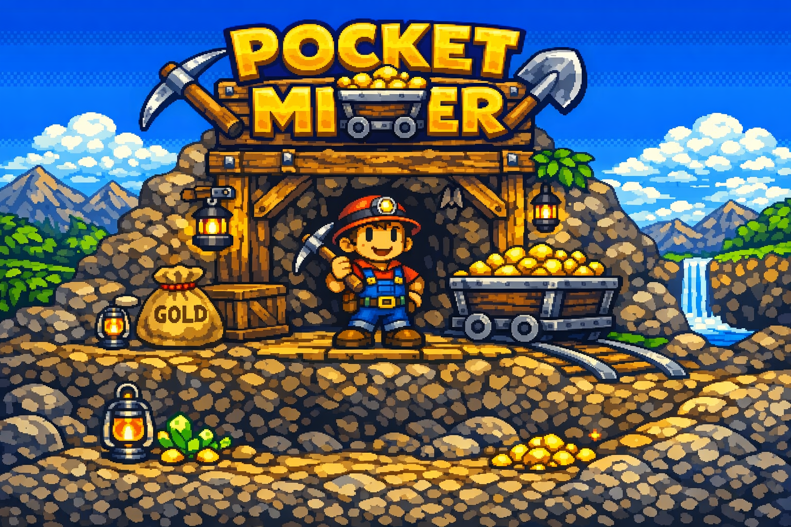
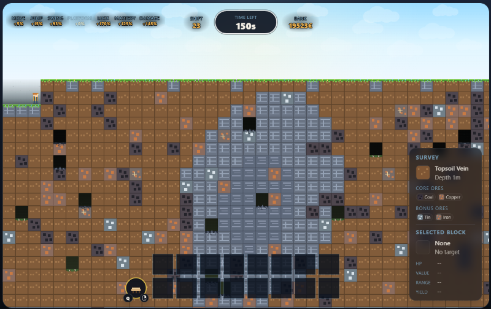
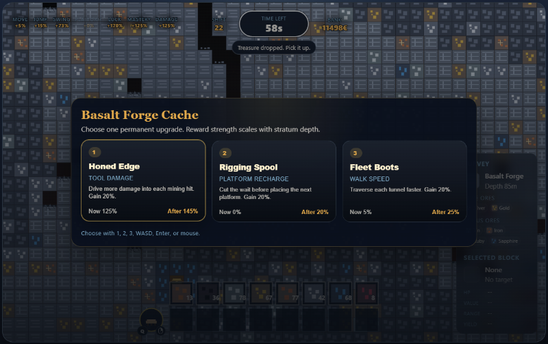
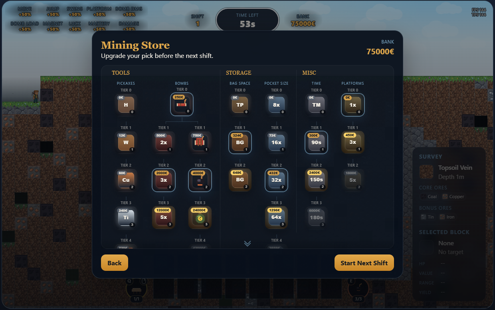

# Pocket Miner



Pocket Miner is a browser-based mining game built as a static HTML/CSS/JavaScript project. It does not require a build step, backend, or package install to run.

## How To Play

Each shift drops you into a fresh mine with a time limit. Mine valuable ore, collect what drops, survive until the timer ends, then bank your earnings and spend them on upgrades before the next shift.

Your long-term goal is to dig deeper, carry more loot, and improve your permanent stat bonuses so each shift becomes more productive than the last.

## Player Controls

### Movement And Mining

- `A` or `Left Arrow`: move left
- `D` or `Right Arrow`: move right
- `W` or `Up Arrow`: jump
- `S` or `Down Arrow`: drop down through a platform
- `Space` or `Left Mouse Button`: mine the block under your cursor
- `Q` or `Right Mouse Button`: use the current primary tool at the cursor
- `E`: use the current secondary tool at the cursor
- `Tab`: swap which tool is primary and secondary

At the start of a run, Platform is the primary tool and Bombs are secondary once unlocked. After swapping with `Tab`, `Q` and `Right Mouse Button` follow the tool shown in the left hotbar dial, while `E` follows the tool shown in the right hotbar dial.

### Reward Screen

- `A`/`Left Arrow`/`W`/`Up Arrow`: move reward selection left or up
- `D`/`Right Arrow`/`S`/`Down Arrow`: move reward selection right or down
- `1`, `2`, `3`: choose a reward directly
- `Enter`, `Space`, or `E`: confirm the selected reward

### Other

- `R`: toggle the performance readout
- Intro and pause screens show a 12-character password you can enter later to restore your progress profile

## Shift Flow

1. Start a shift after the `3-2-1-GO!` countdown.
2. Mine blocks within cursor range and collect the ore drops before the shift ends.
3. Open treasure caches when they appear and choose one permanent bonus.
4. Reach the end-of-shift summary and bank your earnings.
5. Visit the store to buy upgrades, then start the next shift.

## Important Gameplay Notes

- Mining is cursor-targeted. You must point at a mineable block within range of the player.
- Ore is not banked just by breaking blocks. You need to actually collect the dropped items.
- Temporary platforms can only be placed within range, in line of sight, and not inside the player.
- Touching magma ends the shift immediately.
- Every new shift generates a fresh world.
- The countdown before each shift means movement does not begin instantly when you leave the intro or summary screens.

## Upgrades And Progression

Store upgrades are split into a few main branches:

- `Tools`: stronger pickaxes for faster mining and one-swing breakpoints
- `Bombs`: dynamite sticks, dynamite bundles, and heavier mining bombs with stronger payloads
- `Storage`: more inventory slots and larger stack sizes
- `Misc`: longer shift duration

Treasure caches grant permanent stat bonuses such as:

- move speed
- jump power
- swing rate
- platform cooldown reduction
- luck
- mastery
- tool damage

## Passwords

The intro screen and pause screen both display a 12-character password in an NES-style grouped format.

Entering a valid password restores your progression profile:

- unlocked upgrade tiers are restored exactly
- round, bank, and permanent bonus values are restored from the password's compressed form

Because the code is limited to 12 human-entered characters, bank and permanent bonuses are rounded to password tiers when restored.

## Tips

- Early on, focus on ore you can collect consistently rather than reaching too deep too fast.
- Storage upgrades matter quickly because uncollected or uncarried value is lost potential income.
- Platform placement is useful for recovering awkward drops and climbing back through mined shafts.
- Permanent cache bonuses compound over time, so treasure rewards are a major part of progression.

## Screenshots

A few in-game screenshots showing gameplay, reward caches and the store.





## Optional Cheats

Cheat codes are enabled in the current project build.

- `ROSEBUD`: grants `10000€`
- `MOTHERLODE`: grants `50000€`
- `IDFA`: grants `+50%` to all player bonus stats
- `IDKFA`: grants the `IDFA` stat boost plus a stronger loadout upgrade package

## Play Online

This repository is now set up to deploy directly to GitHub Pages.

### GitHub Pages

1. Push this repository to GitHub.
2. In the repository settings, open `Pages`.
3. Set the source to `GitHub Actions`.
4. Push to `main` and the workflow in `.github/workflows/deploy-pages.yml` will publish the game.

Because the project uses only relative asset paths like `./assets/...`, it also works on other static hosts such as:

- GitHub Pages
- Netlify
- Cloudflare Pages
- Vercel static hosting
- any simple web server

## Local Run

Open the repository from a local web server rather than double-clicking `index.html`, because modern browsers restrict module loading and audio/file fetches from the `file` protocol.

Examples:

```powershell
python -m http.server 8000
```

Then open:

```text
http://localhost:8000/
```

## Hosting Notes

- Keep asset filenames and letter casing exactly as they are in the repository. Linux-based hosts are case-sensitive.
- The intro title art is expected at `./assets/title.png` if you want a custom title image. If that file is missing, the game falls back to the text title automatically.
- The project is a static site, so no bundler or transpiler is required for deployment.

## Asset Generation

The runtime terrain atlas used by the renderer is checked in under `assets/tiles/terrain-atlas.png`.

The bomb spritesheet and sound effects are also generated procedurally and checked in under `assets/sprites/bomb-spritesheet.png` and `assets/sfx/`.

Regenerate it after changing tile visuals with:

```powershell
.\generate_tile_assets.ps1
```

Regenerate bomb visuals and bomb audio with:

```powershell
.\generate_bomb_assets.ps1
```

That script writes:

- `assets/tiles/terrain-atlas.png`
- `assets/tiles/terrain-atlas-manifest.json`
- `assets/tiles/terrain-atlas-manifest.js`

The bomb generator writes:

- `assets/sprites/bomb-spritesheet.png`
- `assets/sfx/bomb-fuse.wav`
- `assets/sfx/bomb-explode.wav`

The generator is self-contained and recreates all terrain visuals procedurally, so no separate source tilesheet file is required.

## Password Bit Layout

The password system is implemented in `passwordSystem.js` as a compact fixed-width binary payload that is then encoded into a human-friendly alphabet.

### Character Format

- Total password length: `12` characters
- Data characters: `11`
- Checksum characters: `1`
- Display grouping: `XXXX-XXXX-XXXX`
- Alphabet: `ABCDEFGHJKLMNPQRSTUVWXYZ23456789`

That alphabet is a custom Base32-style set. It intentionally removes ambiguous characters such as `I`, `O`, `0`, and `1` so the code is easier to read aloud and type from memory.

Because each data character stores `5` bits, the first `11` characters carry exactly `55` bits of payload:

$$
11 \times 5 = 55
$$

The twelfth character is not payload. It is a checksum derived from the first `11` characters.

### Payload Layout

The encoder builds a single integer by packing fields from left to right, then emits that integer as `11` Base32 characters. The payload currently uses all `55` available bits.

Field layout, in encode order:

1. Version: `2` bits
2. Pickaxe tier: `4` bits
3. Bag tier: `2` bits
4. Capacity tier: `3` bits
5. Time tier: `2` bits
6. Platform tier: `2` bits
7. Bomb unlocked flag: `1` bit
8. Bomb capacity tier: `2` bits
9. Bomb type tier: `2` bits
10. Round: `5` bits
11. Bank bucket: `7` bits
12. Ten permanent bonus tiers: `20` bits total, `2` bits per bonus

Total:

$$
2 + 4 + 2 + 3 + 2 + 2 + 1 + 2 + 2 + 5 + 7 + (10 \times 2) = 55
$$

### What Each Field Means

#### Version: 2 bits

This allows up to `4` password format versions. The current implementation uses version `1`.

#### Pickaxe tier: 4 bits

This field can represent values from `0` to `15`. The current game only uses the first nine values:

- `0`: bare-hands
- `1`: wood-pick
- `2`: copper-pick
- `3`: tin-pick
- `4`: iron-pick
- `5`: silver-pick
- `6`: gold-pick
- `7`: ruby-pick
- `8`: sapphire-pick

#### Bag tier: 2 bits

This field can represent values from `0` to `3`. The game currently uses:

- `0`: trouser-pockets
- `1`: bag-1
- `2`: bag-2

#### Capacity tier: 3 bits

This field can represent values from `0` to `7`. The game currently uses:

- `0`: small-size
- `1`: capacity-1
- `2`: capacity-2
- `3`: capacity-3
- `4`: capacity-4

#### Time tier: 2 bits

This field stores the active shift-duration upgrade:

- `0`: time-root
- `1`: time-1
- `2`: time-2
- `3`: time-3

#### Platform tier: 2 bits

This field stores the platform rig upgrade:

- `0`: platform-rig
- `1`: platform-1
- `2`: platform-2

#### Bomb unlocked flag: 1 bit

- `0`: bombs are locked
- `1`: bombs are unlocked

If bombs are locked, the bomb capacity and bomb type fields are still present in the payload, but they are ignored during restore.

#### Bomb capacity tier: 2 bits

This field maps to the compact bomb rack tier list:

- `0`: bomb-capacity-root
- `1`: bomb-capacity-2
- `2`: bomb-capacity-3
- `3`: bomb-capacity-5

#### Bomb type tier: 2 bits

This field maps to the compact bomb type list:

- `0`: bomb-type-root
- `1`: bomb-type-2
- `2`: bomb-type-3
- `3`: bomb-type-4

#### Round: 5 bits

Five bits allow values from `0` to `31`, which are stored as rounds `1` through `32`.

The encoder stores:

$$
	ext{storedRound} = \text{clamp}(\text{round}, 1, 32) - 1
$$

The decoder restores:

$$
	ext{round} = \text{storedRound} + 1
$$

That means the password system cannot represent rounds above `32`. Higher rounds are clamped to `32` when encoded.

#### Bank bucket: 7 bits

Seven bits allow values from `0` to `127`.

The live bank is not stored exactly. It is quantized in `500€` steps:

$$
	ext{bankBucket} = \text{clamp}(\text{round}(\text{bank} / 500), 0, 127)
$$

On restore, the bank becomes:

$$
	ext{restoredBank} = \text{bankBucket} \times 500
$$

So the maximum encoded bank is:

$$
127 \times 500 = 63500€
$$

Anything above that is clamped when the password is generated.

#### Bonus tiers: 20 bits total

There are `10` permanent bonus stats:

- moveSpeed
- jumpPower
- swingRate
- platformCooldown
- bombDamage
- bombRestock
- pickupMagnetism
- luck
- mastery
- toolDamage

Each stat gets `2` bits, so each one stores a value from `0` to `3`.

The encoder does not store raw floating-point bonus values. It quantizes them using these thresholds:

- tier `0`: value `< 0.05`
- tier `1`: `0.05 <= value < 0.175`
- tier `2`: `0.175 <= value < 0.375`
- tier `3`: value `>= 0.375`

When a password is restored, each tier becomes one of these exact values:

- tier `0` -> `0`
- tier `1` -> `0.1`
- tier `2` -> `0.25`
- tier `3` -> `0.5`

This is why passwords preserve the general strength of a build, but not the exact original chest-reward floating-point values.

### Checksum

The last character is a checksum over the first `11` characters, not over the raw bitfields directly.

For each data character, the encoder looks up its alphabet index and computes:

$$
	ext{checksum} = \left(\sum_{i=0}^{10} \text{value}_i \times (i + 3)\right) \bmod 32
$$

The resulting number selects the final character from the same Base32 alphabet.

This is not a cryptographic checksum. It is only there to catch mistyped passwords and reject obviously invalid codes.

### Encoding Flow

At a high level, password generation works like this:

1. Extract a compact progression snapshot from the live game state.
2. Convert upgrade ids to compact tier indices.
3. Clamp and quantize round, bank, and permanent bonuses.
4. Pack all fields into one `55`-bit integer.
5. Encode that integer into `11` Base32 characters.
6. Compute the checksum character.
7. Format the result as `XXXX-XXXX-XXXX` for display.

### Decoding Flow

Password restore does the reverse:

1. Normalize input to uppercase and strip separators.
2. Reject unsupported characters.
3. Require exactly `12` characters.
4. Verify the checksum.
5. Decode the first `11` characters back into the `55`-bit payload.
6. Unpack fields from right to left.
7. Rebuild tier ids and normalized bonus values.
8. Restore the game into a fresh round with a new world seed.

### Why The System Is Lossy

The game intentionally uses a lossy password system because the design target was a short, human-entered password instead of a long exact save code.

With only `55` payload bits available, the password cannot store all of the following exactly at once:

- every upgrade and unlock state
- arbitrary round values
- arbitrary bank values
- ten floating-point permanent bonus values

So the implementation keeps upgrade and unlock tiers exact, while round is capped and bank and bonus values are quantized. That tradeoff is what makes a short memorisable password possible.
